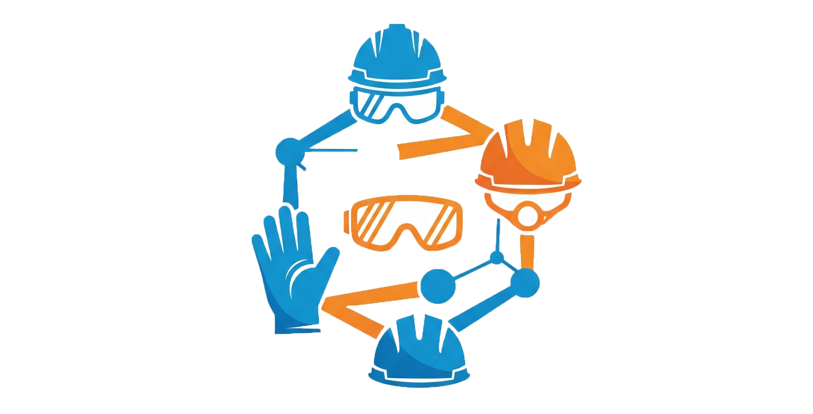

<a id="readme-top"></a>

<div align="center">

[](https://www.python.org/)
  [](https://opencv.org/)
  [](https://ultralytics.com/)
  [](https://github.com/cvzone/cvzone)
  [](https://pytorch.org/)
  [](https://docs.python.org/3/library/math.html)

<br />

[](mailto:dhanrajaayush123@gmail.com)
[](mailto:ayushdhanraj.work@gmail.com)
[](https://www.linkedin.com/in/ayush-d-1759461a1)
[](https://github.com/Ayush-2001-Dhanraj)
</div>


<br />
<div align="center">
  

  <h3 align="center">Real-time PPE Compliance Monitoring System</h3>

  <p align="center">
    A project demonstrating real-time detection of essential safety equipment (hardhats, masks, safety vests) in video streams and webcam feeds using a custom-trained YOLOv8 model.
    <br />
    <a href="https://github.com/Ayush-2001-Dhanraj/Object-Detection/tree/main/PPE%20Detection#readme"><strong>View on GitHub</strong></a>
  </p>
</div>

<details>
  <summary>Table of Contents</summary>
  <ol>
    <li><a href="#about-the-project">About The Project</a></li>
    <li><a href="#built-with">Built With</a></li>
    <li><a href="#getting-started">Getting Started</a>
      <ul>
        <li><a href="#prerequisites">Prerequisites</a></li>
        <li><a href="#installation">Installation</a></li>
      </ul>
    </li>
    <li><a href="#usage">Usage</a></li>
    <li><a href="#contact">Contact</a></li>
  </ol>
</details>

## About The Project

This project implements a real-time object detection system to identify the presence or absence of critical Personal Protective Equipment (PPE) such as `hardhats`, `masks`, and `safety vests`. It utilizes a custom-trained YOLOv8 model to analyze video streams from webcams or video files. The system visually highlights detected objects with bounding boxes, differentiating between the presence and absence of required PPE.

This project showcases skills in computer vision, object detection using YOLOv8, real-time video processing, and the application of deep learning for safety monitoring.

<p align="right">(<a href="#readme-top">back to top</a>)</p>

### Built With

This project was built using the following key technologies:

* [](https://www.python.org/)
* [](https://opencv.org/)
* [](https://ultralytics.com/)
* [](https://github.com/cvzone/cvzone)
* [](https://pytorch.org/)
* [](https://docs.python.org/3/library/math.html)


<p align="right">(<a href="#readme-top">back to top</a>)</p>

## Getting Started

To run this project locally, follow these steps.

### Prerequisites

Ensure you have the following installed on your system:

* Python (>= 3.7)
* pip (Python package installer)

### Installation

1.  Clone the repository:
    ```sh
    git clone https://github.com/Ayush-2001-Dhanraj/Object-Detection.git
    ```

2.  Install the required Python packages:
    ```sh
    pip install -r requirements.txt
    ```
    *(Note: You might need to install PyTorch separately based on your system's CUDA availability. Refer to the [PyTorch website](https://pytorch.org/get-started/locally/) for specific instructions.)*

3.  Download the pre-trained YOLOv8 weights (if not already present):
    The code assumes the `ppe.pt` weights are in the `yolo_weights` directory. You can train your own modal using [Construction Safety Data](https://universe.roboflow.com/roboflow-universe-projects/construction-site-safety/dataset/28/download) or use the `ppe.pt` model present in the main directory.
<p align="right">(<a href="#readme-top">back to top</a>)</p>

## Usage

To run the Real-time PPE Compliance Monitoring System from your webcam:

```sh
python ppe_detection.py
```
The application will open a window displaying the webcam feed with detected cards and the identified poker hand.

You can also adapt the capture variable in the script to process a video file instead of a live webcam feed.

<p align="right">(<a href="#readme-top">back to top</a>)</p>

## Contact

Feel free to reach out if you have any questions, suggestions, or would like to collaborate!

* [](https://www.linkedin.com/in/ayush-d-1759461a1)
* [](mailto:dhanrajaayush123@gmail.com)
* [](mailto:ayushdhanraj.work@gmail.com)
* [](https://www.linkedin.com/in/ayush-d-1759461a1)
* [](https://github.com/Ayush-2001-Dhanraj)

<p align="right">(<a href="#readme-top">back to top</a>)</p>
